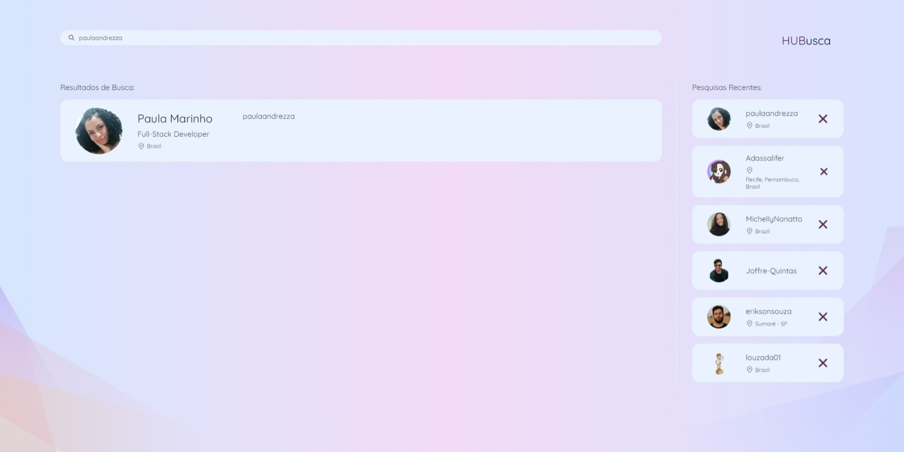
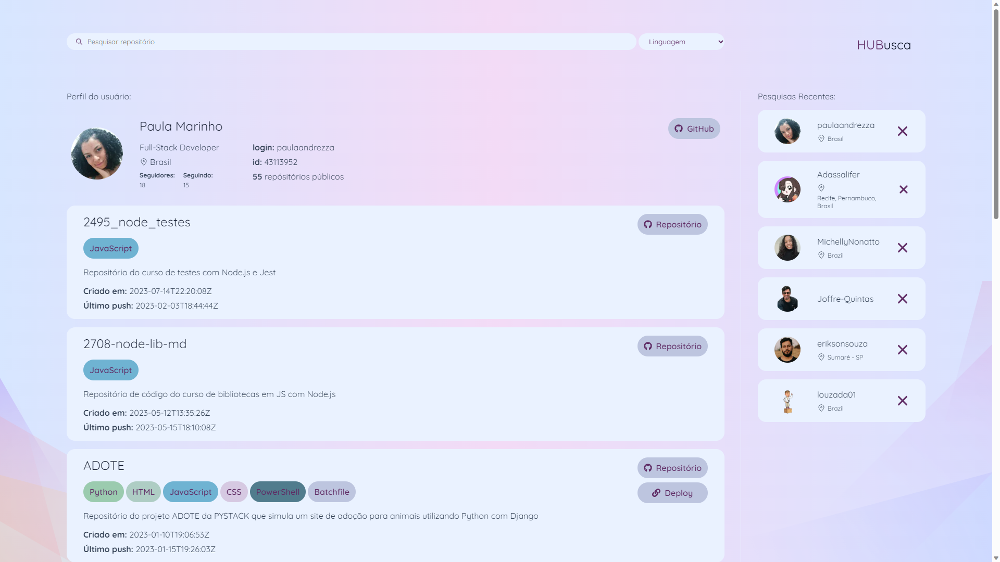

# Desafio Click Soft

## 📑 Sobre o Projeto

Este projeto consiste em uma página de busca de perfis e repositórios do github desenvolvida como parte de um teste para um processo
seletivo na ClickSoft. A página foi criada para demonstrar meus conhecimentos e habilidades em
desenvolvimento web.

<p align="center">
    
    
</p>

## 📝 Requisitos do projeto

1. Permita que na tela principal busquemos os dados de uma pessoa do GitHub através do nome de usuário. E que no resultado apareça a foto, o nome, o login e a localização.
2. Permita que ao clicar na foto, abra um perfil com os dados que a API do GitHub fornece: Foto, nome, login, localização, o ID, quantidade de seguidores, quantidade de repositórios públicos, e uma lista com todos os repositórios da pessoa (nome do repositório, linguagem utilizada, descrição, data de criação, data do último push).
3. Ao clicar em um repositório, seremos redirecionados para este repositório no site do GitHub.
4. Crie um menu contendo todos os usuários pesquisados recentemente, que também siga o padrão com os dados iguais ao da tarefa 1, e com perfil igual ao da tarefa 2.

## ✨ Tecnologias Utilizadas

Durante o desenvolvimento do projeto, foram tomadas algumas decisões importantes para garantir a
qualidade, organização e eficiência do código. Abaixo estão as tecnologias utilizadas.

- [NextJs](https://nextjs.org/): Um framework React que oferece renderização híbrida, otimização de desempenho e facilidades de roteamento para aplicativos web modernos.
- [TypeScript](https://www.typescriptlang.org/): Uma extensão do JavaScript que fornece tipagem estática, ajudando a prevenir erros e melhorar a legibilidade do código.
- [Styled-Components](https://styled-components.com/): Uma biblioteca que permite estilizar componentes React de forma modular e encapsulada, melhorando a organização dos estilos.
- [React-Icons](https://react-icons.github.io/react-icons/): Uma biblioteca que oferece uma ampla gama de ícones prontos para uso em projetos React, simplificando a adição de ícones aos componentes.
- [Axios](https://axios-http.com/ptbr/docs/intro): Uma biblioteca para fazer requisições HTTP em aplicativos JavaScript, facilitando o gerenciamento de chamadas de API e respostas HTTP.

<br>

## 📚 Organização do Código

A estrutura de pastas do projeto é organizada da seguinte forma:

```
├── public
│   └── ...
│
└── src
    ├── app
    │   ├── favicon.ico
    │   ├── layout.tsx
    │   ├── page.tsx
    │   ├── theme
    │   │   ├── globalStyles.ts
    │   │   ├── shared.ts
    │   │   └── theme.ts
    │   └── user
    │       └── [username]
    │           └── page.tsx
    │
    ├── components
    │   ├── Card
    │   │   └── ...
    │   ├── ProfileCard
    │   │   └── ...
    │   ├── RepoCard
    │   │   └── ...
    │   ├── SearchBar
    │   │   └── ...
    │   ├── Select
    │   │   └── ...
    │   └── SmallCard
    │       └── ...
    │
    ├── layouts
    │   └── ...
    │
    ├── lib
    │   └── registry.tsx
    │
    └── services
        ├── interfaces
        │   └── ...
        └── users
            └── ...
```

- No diretório `public`, encontramos os arquivos estáticos relacionados à aplicação. Todos esses
  arquivos são acessíveis publicamente.

- Dentro do diretório src, encontra-se a pasta app, que serve como a espinha dorsal da aplicação. Esta pasta contém diversos elementos-chave:

  - `favicon.ico`: Este arquivo representa o ícone exibido na aba do navegador.
  - `layout.tsx`: Trata-se de um componente que descreve a estrutura visual compartilhada entre várias páginas.
  - `page.tsx`, atua como um componente central que encapsula o conteúdo e a lógica associados a rota raiz da aplicação.
  - `theme`: Este diretório contém os arquivos relacionados aos estilos globais e compartilhados da aplicação, garantindo uma aparência consistente em todo o aplicativo.
  - `user`: Dentro dessa pasta encontra-se a pasta `[username]`, que representa uma rota dinâmica. Esta rota contém o arquivo `page.tsx`, que desempenha o papel crucial na renderização da página específica para essa rota. Isso permite que diferentes páginas sejam criadas dinamicamente com base em diferentes valores de `[username]`.

- Dentro do diretório `components`, temos diversos componentes reutilizáveis, como `Card`, `ProfileCard`, `RepoCard`, `SearchBar`, `Select` e
  `SmallCard`, cada um com sua estrutura de arquivos específica.

- O diretório `lib` contém o arquivo `registry.tsx` que é responsável por lidar com a renderização
  correta e o gerenciamento de estilos do pacote Styled Components em uma aplicação Next.js.

- O diretório `layouts`, possui componentes como `Aside`, `Logo`, `Main` e `UserMain`. Esses componentes são projetados para serem utilizados no grid da aplicação e são responsáveis por estruturar diferentes partes da interface.

- No diretório `services`, a pasta `interfaces` contém a tipagem das requisições de usuário e repositórios, garantindo que o código esteja bem tipado e seguro. A pasta `users` contém o código para realizar as requisições à API do GitHub para obter informações sobre usuários e repositórios, permitindo a construção das funcionalidades de busca e detalhamento.

Essa estrutura organizada e modular contribui para um desenvolvimento mais eficiente, facilitando a adição de novos recursos e a manutenção do código ao longo do tempo.

<br>

## 🎯 Funcionalidades

### Busca de Dados do GitHub:

Na tela principal, os usuários podem buscar os dados de uma pessoa no GitHub através do nome de usuário.
Os resultados da busca incluem a foto do perfil, nome, login e localização da pessoa.

### Perfil Detalhado:

Ao clicar na foto do perfil na tela principal, os usuários podem acessar um perfil detalhado.
O perfil detalhado exibe informações como a foto do perfil, nome, login, localização, ID, quantidade de seguidores, quantidade de repositórios públicos e uma lista com todos os repositórios da pessoa.
A lista de repositórios inclui o nome do repositório, linguagem utilizada, descrição, data de criação e data do último push.

### Acesso aos Repositórios no GitHub:

Ao clicar em um repositório na lista de repositórios do perfil detalhado, os usuários são redirecionados para a página correspondente desse repositório no site do GitHub.

### Menu de Usuários Recentes:

Um menu contendo todos os usuários pesquisados recentemente é exibido.
Cada entrada no menu inclui a foto do perfil, nome, login e localização do usuário.
Ao clicar em um usuário do menu, os dados desse usuário são exibidos na tela principal, similar à funcionalidade de busca.

### Pesquisa e Filtragem de Repositórios

Os usuários podem realizar uma pesquisa nos repositórios do usuário exibido na tela. Uma barra de pesquisa permite aos usuários inserir palavras-chave para buscar repositórios. A pesquisa é feita tanto pelo nome quanto pela descrição dos repositórios. Além disso, uma opção de filtro por linguagem de programação permite aos usuários filtrar os repositórios exibidos de acordo com a linguagem utilizada.

<br>

## 💻 Instruções de Instalação e de Uso

Para instalar e usar o projeto "teste-leadster", siga as instruções abaixo:

1. Faça um fork do projeto no GitHub: Acesse o link
   [https://github.com/paulaandrezza/desafio-click-soft](https://github.com/paulaandrezza/desafio-click-soft)
   e clique no botão "Fork" no canto superior direito da página. Isso criará uma cópia do projeto em
   seu próprio repositório do GitHub.

2. Clone o repositório: No seu terminal, navegue até o diretório onde deseja clonar o projeto e
   execute o seguinte comando:

   ```
   git clone https://github.com/SEU_USUARIO_GITHUB/desafio-click-soft.git
   ```

   Certifique-se de substituir "SEU_USUARIO_GITHUB" pelo seu nome de usuário no GitHub.

3. Acesse o diretório do projeto: Execute o seguinte comando no terminal para entrar no diretório do
   projeto:

   ```
   cd desafio-click-soft
   ```

4. Instale as dependências: Execute o comando a seguir para instalar as dependências do projeto usando o npm:

   ```
   npm install
   ```

5. Inicie o servidor de desenvolvimento:

   ```
   npm run dev
   ```

6. Acesse o projeto: Abra o seu navegador e digite o seguinte endereço:
   ```
   http://localhost:3000
   ```
   Agora você poderá visualizar e interagir com o projeto "desafio-click-soft" localmente em seu
   ambiente de desenvolvimento.

É possível acessar o deploy do projeto no seguinte link:
[Desafio Click Soft](https://desafio-click-soft.vercel.app/).

<br>

## Dificuldades Encontradas

### Paginação de Resultados

Durante o desenvolvimento do projeto, ao coletar informações de repositórios por meio da API do GitHub, deparei-me com o desafio da paginação de resultados. A API do GitHub retorna uma página com até 30 repositórios por vez. No entanto, para perfis com um grande número de repositórios, era necessário realizar múltiplas solicitações para obter todas as informações desejadas.

Para enfrentar esse cenário, adotei a lógica de paginação conforme orientado na documentação oficial do GitHub. Para isso, a documentação de paginação fornece diretrizes sobre como lidar com os Headers de página. Caso a resposta inclua um Header de link com o atributo `rel="next"`, a função utiliza um padrão de expressão regular (nextPattern) para extrair a URL da próxima página. A função, então, repete as etapas anteriores, mas agora usando essa nova URL. Uma vez que o Header de link não contenha mais uma referência para a próxima página, todos os resultados são retornados. Essa abordagem proporciona uma maneira eficiente de coletar os dados paginados, conforme detalhado na [documentação oficial](https://docs.github.com/en/enterprise-server@3.10/rest/guides/using-pagination-in-the-rest-api?apiVersion=2022-11-28).

Essa abordagem garantiu que eu conseguisse coletar de maneira eficiente e organizada todos os dados dos repositórios, independentemente do número de páginas envolvidas.

### Autenticação para Aumento de Limite de Taxa

Durante a execução do projeto, surgiu um desafio relacionado à limitação de taxa na API do GitHub. Devido à necessidade de realizar múltiplas requisições para coletar informações detalhadas dos repositórios, incluindo suas linguagens, frequentemente atingimos o limite de taxa da API.

Essa limitação resultava na seguinte mensagem:

```
"message": "API rate limit exceeded for 179.127.97.10. (But here's the good news: Authenticated requests get a higher rate limit. Check out the documentation for more details.)",
"documentation_url": "https://docs.github.com/rest/overview/resources-in-the-rest-api#rate-limiting"
```

Para superar essa restrição e permitir um fluxo contínuo de desenvolvimento, implementamos a autenticação utilizando um token de acesso à API do GitHub. Isso aumentou o limite de taxa de 60 para até 5000 requisições por hora, possibilitando a coleta eficiente de dados dos repositórios.

Essa adaptação me permitiu lidar de maneira mais eficaz com os limites de taxa da API, garantindo um desenvolvimento contínuo e sem interrupções.

Para mais informações sobre o limite de taxa e a autenticação na API do GitHub, consulte a [documentação oficial](https://docs.github.com/rest/overview/resources-in-the-rest-api#rate-limiting).

## 👩 Autora

- Nome: Paula Marinho
- E-mail: [paulaandrezza25@gmail.com](mailto:paulaandrezza25@gmail.com)
- [Perfil no GitHub](https://github.com/paulaandrezza)
- [Perfil no LinkedIn](https://www.linkedin.com/in/paula-andrezza/)
- [Meu portfólio](https://paulaandrezza.github.io/portfolio/)
